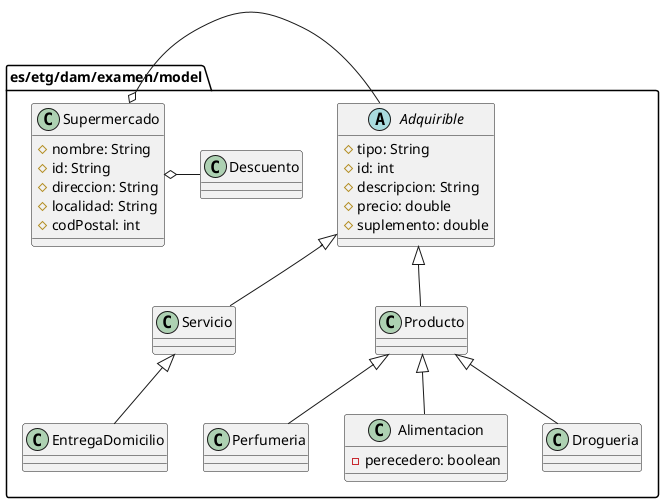

```plantuml
@startuml
package es/etg/dam/examen/model{
    class Supermercado{
        # nombre: String
        # id: String
        # direccion: String
        # localidad: String
        # codPostal: int
    }
    abstract Adquirible{
        # tipo: String
        # id: int
        # descripcion: String
        # precio: double
        # suplemento: double
    }
    class Servicio extends Adquirible{

    }
    class Producto extends Adquirible{

    }
    class Descuento{

    }
    class EntregaDomicilio extends Servicio{

    }
    class Perfumeria extends Producto{

    }
    class Alimentacion extends Producto{
        - perecedero: boolean
    }
    class Drogueria extends Producto{

    }

    Supermercado o- Adquirible
    Supermercado o- Descuento

}


@enduml
```